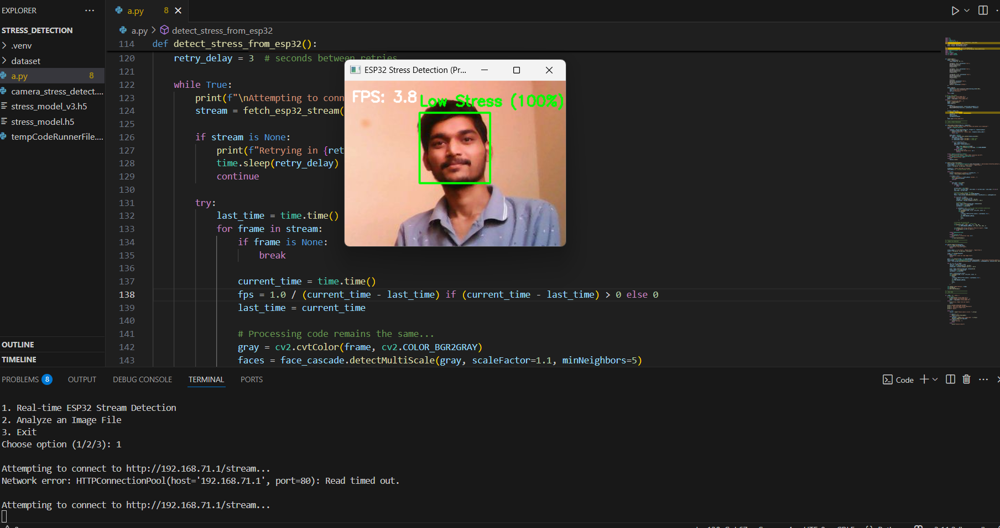
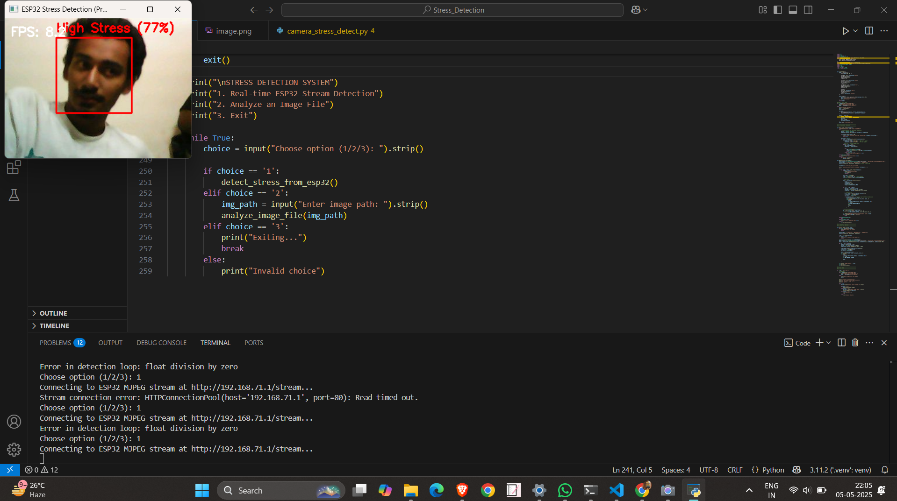

# 🧠 Multimodal Stress Detection System

🚀 Published Patent Project | Computer Vision + Deep Learning + Physiological Signal Analysis + AI

A multimodal stress detection system that combines **facial emotion recognition** and **physiological signal analysis** to perform real-time stress assessment.

Unlike traditional approaches that rely on a single modality, this system integrates:

- 🎥 Facial Emotion Analysis (Computer Vision)
- ❤️ Physiological Signal Processing
- 🧠 Deep Learning (CNN)
- 📊 Machine Learning (K-Means Clustering)

to provide more robust and reliable stress prediction.

---

# 🏆 Published Patent

### Stress Monitoring Device using Physiological and Psychological Parameters

📄 Published in Indian Patent Office (2025)

📌 Patent Application No: **202521066859A**

The proposed system analyzes both physiological and psychological indicators to monitor stress levels and provide personalized feedback.

---

# 📌 Overview

Stress is one of the leading factors affecting human productivity, health, and well-being.

This project aims to automatically identify stress levels by combining:

### Psychological Parameters

- Facial Expressions
- Emotional States

### Physiological Parameters

- Body Temperature
- Blood Oxygen (SpO₂)
- Pulse Rate

The multimodal approach improves robustness compared to traditional single-source stress detection systems.

---

# 🚀 Key Features

- 🎥 Real-time webcam-based stress detection
- 📷 ESP32 camera stream integration
- 🧠 CNN-based facial emotion recognition
- ❤️ Physiological signal analysis
- 📊 K-Means clustering for stress pattern identification
- 📉 PCA-ready feature analysis pipeline
- ⚡ Real-time stress classification
- 💾 Model persistence using HDF5 and Joblib
- 🧩 Modular architecture for future sensor integration

---

# 📸 Demo Results

## 🟢 Low Stress Detection



The CNN-based facial emotion recognition model successfully classifies the subject as **Low Stress** in real time.

---

## 🔴 High Stress Detection



The system detects stress-related facial patterns and classifies the subject as **High Stress** while displaying prediction confidence on the live video stream.

---

# 🏗️ System Architecture

```text
Webcam / ESP32 Camera Stream
            │
            ▼
      Face Detection
    (Haar Cascade)
            │
            ▼
 Facial Emotion Recognition
       CNN Model
            │
            ▼
 Stress Level Prediction
 (Low / Medium / High)
            │
            ▼
 Real-Time Visualization


Physiological Signals
(Temperature, SpO₂, Pulse Rate)
            │
            ▼
     StandardScaler
            │
            ▼
      K-Means Clustering
            │
            ▼
 Physiological Stress Pattern
```

---

# 🧪 Models Used

## 1️⃣ CNN-Based Facial Stress Detection

The facial emotion recognition pipeline uses a Convolutional Neural Network (CNN) trained on facial emotion images.

### Input

- 48 × 48 Grayscale Face Images

### Architecture

```text
Conv2D (32) + ReLU
        ↓
MaxPooling
        ↓
Conv2D (64) + ReLU
        ↓
MaxPooling
        ↓
Conv2D (128) + ReLU
        ↓
MaxPooling
        ↓
Flatten
        ↓
Dense (256)
        ↓
Dropout (0.5)
        ↓
Softmax (3 Classes)
```

### Output Classes

- 🟢 Low Stress
- 🟡 Medium Stress
- 🔴 High Stress

### Frameworks

- TensorFlow
- Keras
- OpenCV
- NumPy

---

## 2️⃣ K-Means Physiological Stress Analysis

The physiological stress detection module uses unsupervised machine learning.

### Features

- Temperature
- Oxygen Saturation (SpO₂)
- Pulse Rate

### Pipeline

```text
Raw Sensor Data
        ↓
StandardScaler
        ↓
K-Means Clustering
        ↓
Stress Pattern Groups
```

### Frameworks

- Scikit-Learn
- Pandas
- Joblib

---

# 💻 Technologies Used

## Programming

- Python

## Deep Learning

- TensorFlow
- Keras

## Computer Vision

- OpenCV
- Haar Cascade Face Detection

## Machine Learning

- Scikit-Learn
- K-Means Clustering

## Data Processing

- NumPy
- Pandas

## Model Storage

- HDF5
- Joblib

---

# 📂 Project Structure

```text
AI-Powered-Stress-Monitoring-System/
│
├── Screenshot/
│   ├── low_stress_detection.png
│   ├── high_stress_detection.png
│
├── src/
│   ├── cnn_model.py
│   ├── kmeans_model.py
│   └── realtime_detection.py
│
├── README.md
│
└── models/
```

---

# ⚙️ Installation

## Clone Repository

```bash
git clone https://github.com/Anchal-20/AI-Powered-Stress-Monitoring-System-.git

cd AI-Powered-Stress-Monitoring-System-
```

## Install Dependencies

```bash
pip install -r requirements.txt
```

---

# ▶️ Train CNN Model

```bash
python src/cnn_model.py
```

The trained model will be saved as:

```text
models/stress_detector.h5
```

---

# ▶️ Train K-Means Model

```bash
python src/kmeans_model.py
```

Generated files:

```text
models/stress_kmeans_model.pkl

models/stress_scaler.pkl
```

---

# ▶️ Run Real-Time Stress Detection

```bash
python src/realtime_detection.py
```

The webcam feed will open and display:

- Detected Face
- Stress Category
- Real-Time Predictions

---

# 📊 Stress Classification

| Stress Level | Description |
|-------------|-------------|
| 🟢 Low | Relaxed / Stable Emotional State |
| 🟡 Medium | Moderate Stress Indicators |
| 🔴 High | Elevated Stress Indicators |

---

# 🎯 Applications

- Mental Health Monitoring
- Smart Healthcare Systems
- Employee Wellness Programs
- Stress-Aware Human Computer Interaction
- Wearable Health Monitoring
- Smart Hospitals
- AI-Assisted Wellness Platforms

---

# 🔮 Future Improvements

- Multimodal Fusion Network
- Transformer-Based Emotion Recognition
- Mobile Application Deployment
- Cloud-Based Monitoring Dashboard
- Real-Time Sensor Integration
- Personalized Stress Baseline Learning
- Explainable AI (XAI)
- LSTM-Based Temporal Stress Analysis


# ⭐ Project Status

✅ Published Patent

✅ CNN-Based Facial Emotion Analysis

✅ K-Means Physiological Analysis

✅ Real-Time Webcam Inference

✅ ESP32 Camera Integration

